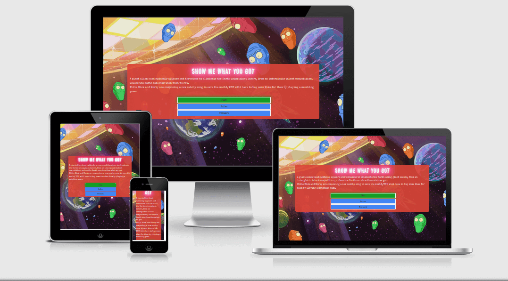
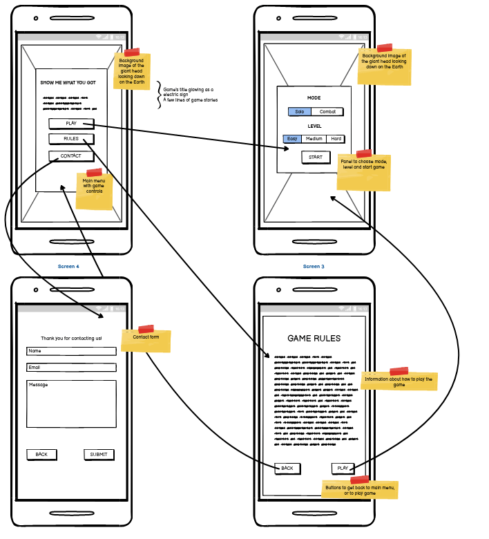
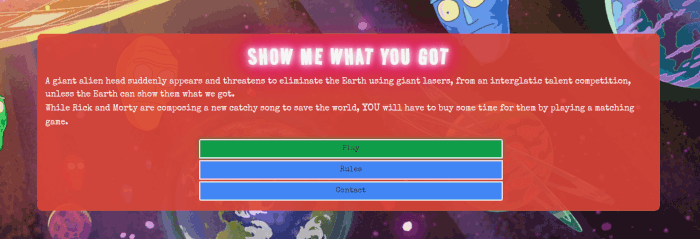
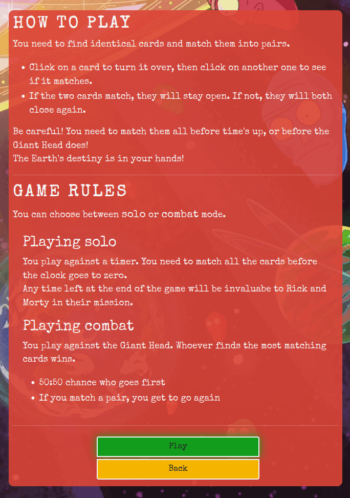
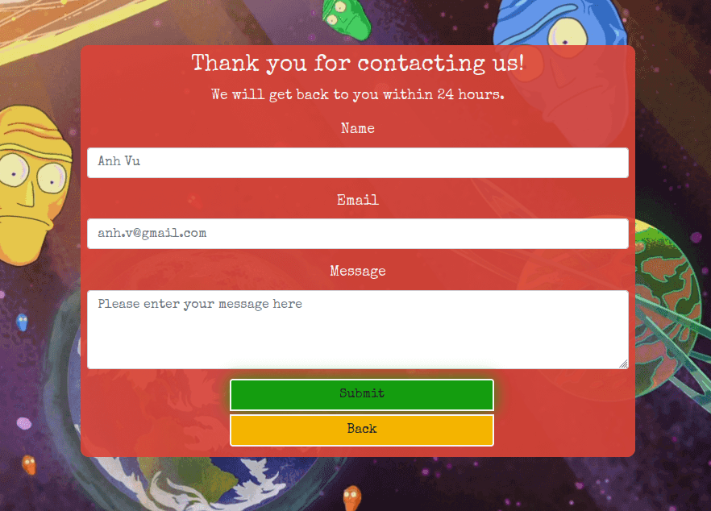
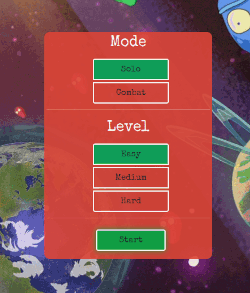
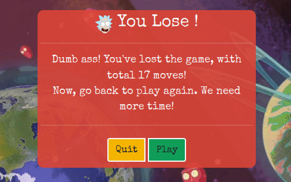

# Show Me What You Got
__[View the live project here](https://chubbyanh.github.io/show-me-what-you-got/)__

[ami.responsivedesign.is](http://ami.responsivedesign.is/)

__Show Me What You Got__ is a memory matching game using characters from [Rick and Morty tv series](https://www.imdb.com/title/tt2861424/). Gamers can play solo against the countdown timer or against the computer (a.k.a. the giant alien head). This mini webgame targets gamers using mobile/tablet but also can be played on desktop.

This is the second porfolio project with [Code Institute](https://codeinstitute.net/ie/). The main purpose of this project is to design an interactive Front-End web application using HTML, CSS and JavaScript based on the principles of user experience design, accessibility and responsivity.

## Table of Contents:
1. [Game Design](#game-design)
    1. [Target Users](#target-users)
    2. [Game Story](#game-story)
    2. [Game Play](#game-play)
    3. [Visual Design](#visual-design)
2. [Features](#features)
    1. [Existing Features](#existing-features)
    2. [Features Left to Implement](#features-left-to-implement)
3. [Technologies Used](#technologies-used)
4. [Testing](#testing)
    1. [Validator Testing](#validator-testing )
    2. [Unfixed Bugs](#unfixed-bugs)
5. [Deployment](#deployment)
    1. [GitHub Pages](#github-pages)
    2. [Forking Repository](#forking-the-github-repository)
    3. [Cloning the project](#cloning-the-project)
8. [Credits](#credits)
    1. [Content](#content)
    2. [Media](#media)
    3. [Code](#code)
9. [Acknowledgements](#acknowledgements)
10. [Disclaimer](#disclaimer)

## Game Design
### Target Users
This is a hobby project with the main purpose is to show my study results in JavaScript module with Code Institute. Therefore I don't have a business strategy here. My target users could be:
- People who want to play simple games on the go
- People who want to improve their memory skills by playing games
- People who are fans of Rick and Morty tv series and want to play some fun games with related characters and stories

### Game Story

A giant alien head suddenly appears and threatens to eliminate the Earth using giant lasers, from an interglatic talent competition, unless the Earth can show them what we got. While Rick and Morty are composing a new catchy song to save the world, __you__ will have to buy some time for them by playing a matching game.

### Game Play
There are __02 play modes__: play solo against the countdown timer (under the giant head's supervision, of course!), or play against the giant head itself.

At the beginning of the game, all the cards are mixed up and laid in row, face down on the table.

- __Play solo against the countdown timer:__
   - Player turns 1 card to start the game. This card stays open.
   - Player turns the 2nd card.
     - If these two cards are a pair, then they stay open.
     - If these two cards are not a pair, then they both turn faced down again.
   - Player keeps going like that until all the cards are open within the given time frame (and player wins!); or until time's up (and player loses!)
   - All the attempts will be recorded, so player will know how many attempts they had to try throughout the game.
   - If player wins, they will also know how much unused time they have. That will be the time they contribute to the world saving mission!

- __Play against the giant head:__
   - Who makes the first move of the game (player or the giant head) is random.
   - If player is chosen to start the game, then: player turns the 1st card, this card stays open.
   - Player turns the 2nd card.
      - If these two cards are a pair, then they stay open. It's a match for the player, and he/she can turn 2 more cards.
      - If these two cards are not a pair, then they both turn faced down, and it's the giant head's turn to play.
   - Player and the giant head keep taking turns like that, until all the cards are open. All the matches will be recorded, so at the end of the game, who has most matches will be the winner.

- There are __03 levels__: easy (12 cards), normal (16 cards), and hard (20 cards). At the end of each game, player can choose to stay at the same level/mode, or switch to a different one.

### Visual Design
__Images__

User stories:
- As a player and a Rick and Morty's fan, I want to see my beloved characters and stories in the game.
   - Background images, stories, and characters in the game are borrowed from Rick and Morty tv series.

__Theme colors__

There are 5 main colors used in this game, because I wanted to make the game look fun and cartoonish.
- rgb(245,245,245)
- rgb(15, 157, 88)
- rgb(244, 180, 0)
- rgb(66, 133, 244)
- rgba(219, 68, 55, .9)

__Fonts__

Font 'Special Elite' was used for the whole game. Font 'Road Rage' was used for the game's title.

Because the game's backstory is about an interglatic talent competition, so I wanted to make the game's title glow and look like an electric sign.

## Features
__Wireframe__

### Existing Features
#### __Main Menu__

User stories:
- As a player, I want to know the game's backstory.
   - Backstory appears right under the game's title.

- As a player, I want to navigate with ease throughout the game.
   - There are three buttons on main menu to help user navigate to other sections of the game.

#### __Rules__

User stories:
- As a player, I want to know about this game's rules.
   - Player can learn quickly about the game's rules by clicking on the Rules button.

#### __Contact__

User stories:
- As a player, I want to report a bug or contact with the developer.
   - There is a contact form that help player report a bug or get in contact easily.

#### __Control Panel__

User stories:
- As a player, I want to choose the level of difficulty and the play mode before starting the game.
   - When player clicks on the Play button, there will be a Control Panel to help them choose the level and mode that they want to play at.

- As a player, I want to switch to another level of difficulty and/or another play mode.
   - When player finishes a game, there will be a pop-up to help them choose if they want to keep playing at the same level and mode, or switch.

#### __Game Arena__

User stories:
- As a player, I want to quit the game at any time.
   - There is a Surrender button below the game arena to help player quit at any time.

- As a __solo__ player, I want to know how much time I have left to finish the game.
   - There is a countdown timer on the top of the game arena to help player keep track of how much time they have left.

- As a __combat__ player, I want to know whose turn it is, and current scores between me and the giant head.
   - There is information about the turn, player's score, giant head's score on the top of the game arena.

#### __Messages When Game Ends__

User stories:
- As a player, I want to know if I won or lost.
   - When player finishes a game, there will be a Message to let them know if they won or lost.

- As a __solo__ player, I want to know how many attempts I have made to finish this game.
   - When player finishes a game, there will be a Message to let them know how many attempts they have made to finish this game.

- As a __solo__ player, I want to know how much time I have contributed to the world saving mission!
   - When player wins a game, there will be a Message to let them know how much unused time they still have, and that will be the amount of time they contribute to the world saving mission as well.

- As a __combat__ player, I want to know how many cards I have found, compared to the giant head's.
  - When player finishes a game, there will be a Message to let them know how many cards they have found, compared to the giant head's.

### Features Left to Implement
#### __Sound Effect__

User stories:
- As a player, I want to turn on/ turn off the sound as I wish.
   - The sound is off on default. Player can turn the sound on by clicking on the Sound button.

## Technologies Used
- HTML5, CSS3, Bootstrap 5, JavaScript
- [VSCode](https://code.visualstudio.com/) as development environment, [Git](https://git-scm.com/) as Version Control tool
- [GitHub](https://github.com/) to host my code, [GitHub Pages](https://pages.github.com/) to publish the game
- [Balsamig](https://balsamiq.com/) for wireframing
- [Firefox Dev Tool](https://developer.mozilla.org/en-US/docs/Tools) for debugging
- [Google Font](https://fonts.google.com/) for styling
- [TinyPNG](https://tinypng.com/), [Canva](https://www.canva.com/), [GIMP](https://www.gimp.org/) for optimizing and editing images
- [Favicon.io](https://favicon.io/) to generate favicon img

## Testing
### Validator Testing
jshint and w3c web validator extensions were integrated into VS Code, so that my code could be checked in realtime. As far as I know, the code passed these validator tests.

### Unfixed Bugs
- There is no known unfixed bugs.

## Deployment
### GitHub Pages

The steps to deploy via GitHub Pages:

1. Log into Github account.
2. Navigate to the [Repository](https://github.com/chubbyanh/show-me-what-you-got).
3. Click the 'Settings' option at the top of the repository.
4. Click the 'Pages' option on the left-hand menu, located near the bottom.
5. Within the 'Source' tab Select the drop-down titled 'None'.
6. Select the branch named 'main' (in some cases it can be named 'Master').
7. Click 'Save'.
8. You will be prompted with a URL to your deployed site.
9. Site deployed.

When the above steps have been completed, it can sometimes take a moment for the deployed URL to update. It is enough to refresh the page until the site is fully deployed.

### Forking The GitHub Repository

To use this code and make changes without affecting the original code you can do what is called 'Forking the repository'. By forking this repository you are given a copy of the code at that moment in time that you can use freely. To fork this repository you need to follow the following few steps:

1. Log into your GitHub account.
2. Navigate to the [Repository](https://github.com/chubbyanh/show-me-what-you-got) that you want to fork.
3. In the upper-right of the repository, click the 'Fork' button.
4. A copy of the Repository will now be available within your repositories.

You will now have a copy of the code available to clone and work on without affecting the original code.

### Cloning the Project

To make a local clone of the project follow these steps:

1. Log into your GitHub account.
2. Navigate to the [Repository](https://github.com/chubbyanh/show-me-what-you-got).
3. In the upper section of the repository click the dropdown named 'Code'.
4. Copy the SSH address.
5. Open GitBash
6. Navigate to the correct directory.
7. Create a new directory named 'show-me-what-you-got'.
8. CD into 'show-me-what-you-got'.
9. Enter 'git clone SSH_ADDRESS'
10. GitBash will clone the repository into this directory.
11. Enter 'code .' and this will open VSCode and happy coding.

__[The live link can be found here](https://chubbyanh.github.io/show-me-what-you-got/)__

## Credits
### Content
- Content of this game was written by the developer. However, the game's general rules were taken and adjusted from [memozor.com](https://www.memozor.com/pdf/article/memory_card_game_rules_quick_and_simple.pdf).

### Media
- All images taken from [freepnglogos](https://www.freepnglogos.com/search.php?q=rick+and+morty): free licence for personal use.

### Code
- This game was built on top of [the Simpe Memory Game in Vanilla JavaScript tutorial by Code Boxx](https://code-boxx.com/simple-memory-game-javascript/).
- Other invaluable tutorial sources: [W3 School](https://www.w3schools.com/), [Code Sketch](https://www.youtube.com/watch?v=eMhiMsEC9Uk), [MDN](https://developer.mozilla.org/en-US/docs/Web/javascript), [getbootstrap.com](https://getbootstrap.com/docs/5.1/getting-started/introduction/), [Code Institute](https://codeinstitute.net/ie/), [Stackoverflow](https://stackoverflow.com/).

## Acknowledgements
- I would like to thank my mentor, Guido Cecilio, for his support throughout my project, especially his invaluable feedback during code review sessions.
- I also would like to thank my classmates (msletb-nov-2021 cohort) at Code Institute and Kasia Bogucka, our corhort's facilitator, for their continuing support.
- I would like to thank my husband for being a (temporary) fulltime stay-at-home father so that I could concentrate on my study and get this project done on time. Of course, I would like to thank his employer's generosity on paternity leave as well!

## Disclaimer
This game was created for educational purposes only.